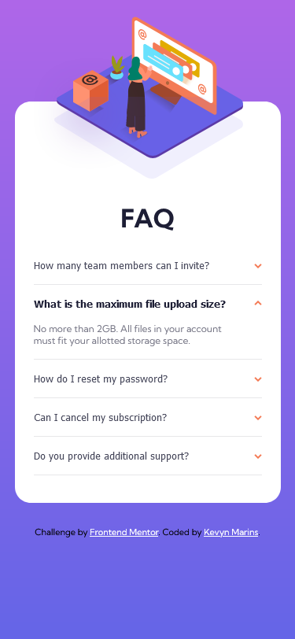
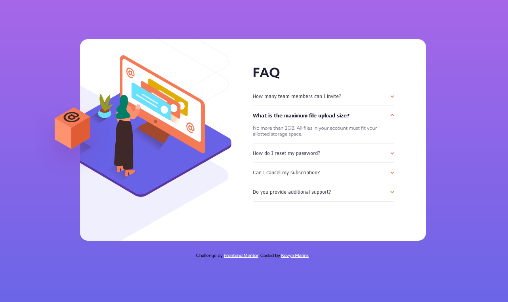

# Frontend Mentor - FAQ accordion card solution

This is a solution to the [FAQ accordion card challenge on Frontend Mentor](https://www.frontendmentor.io/challenges/faq-accordion-card-XlyjD0Oam).

## Table of contents

- [Overview](#overview)
  - [The challenge](#the-challenge)
  - [Screenshot](#screenshot)
  - [Links](#links)
- [My process](#my-process)
  - [Built with](#built-with)
  - [What I learned](#what-i-learned)
  - [Continued development](#continued-development)  
- [Author](#author)


## Overview

### The challenge

Users should be able to:

- View the optimal layout for the component depending on their device's screen size
- See hover states for all interactive elements on the page
- Hide/Show the answer to a question when the question is clicked

### Screenshot

#### Mobile



#### Desktop



### Links

- Live Site URL: [FAQ accordion card](https://kevynsm.github.io/FAQ-accordion-card/)

## My process

### Built with

- Semantic HTML5 markup
- CSS custom properties
- Flexbox
- CSS Grid
- Mobile-first workflow
- Vanilla JavaScript

### What I learned

Here the code I wrote to make the Hide/Show effect:


```js
cconst btnList = document.querySelectorAll(".btn");

btnList.forEach( (btn) => {
    btn.addEventListener("click", function () {
        this.classList.toggle("isOpen");

        let content = this.nextElementSibling;        
        if(content.style.height !== "") {
            content.style.height = "";
        }
        else {
            content.style.height = content.scrollHeight + 'px';
        }
        hideAll(this);
    })
})

const hideAll = (notThis) => {
    btnList.forEach((btn) => {
        if(btn !== notThis) {
            btn.classList.remove("isOpen");
            let content = btn.nextElementSibling;
            content.style.height = "";
        }
    })
}
```

### Continued development

It was my first project using JavaScript and I still have a lot to learn, so for the next project I will continue to practice.


## Author

- Frontend Mentor - [@KevynSM](https://www.frontendmentor.io/profile/KevynSM)
